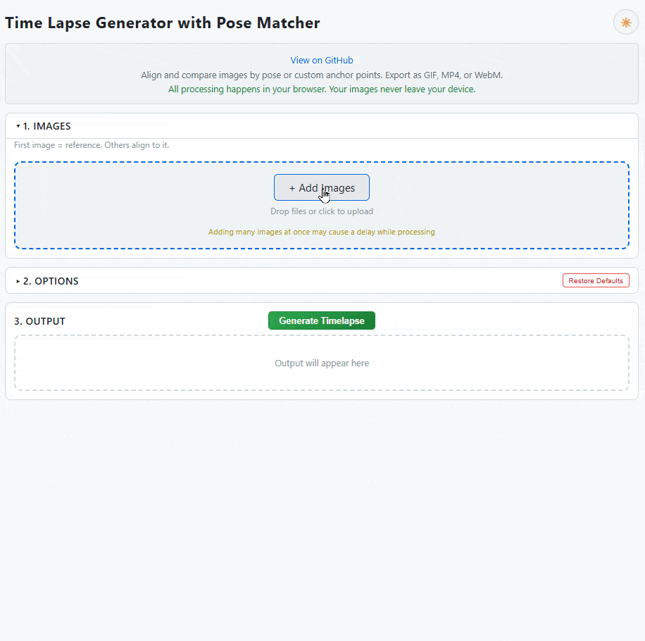
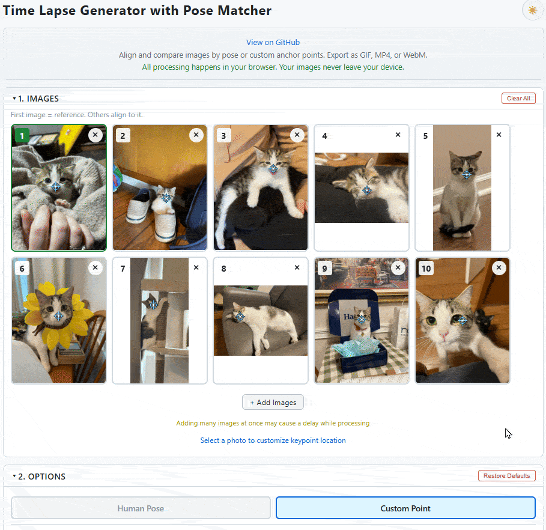
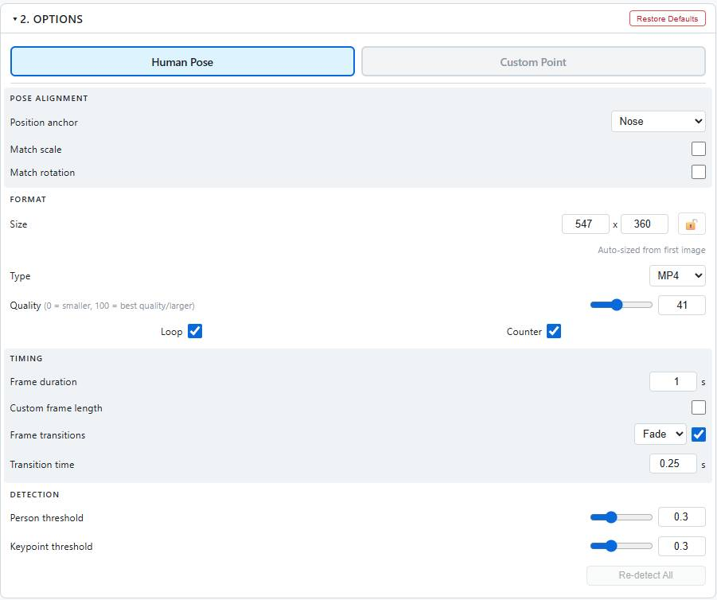

# [Image to Timelapse](title)
### Time Lapse Generator with Pose Matcher

[Link to tool](https://bbelk.github.io/ImageToTimelapse/)

## Table of Contents
1. [Description](#description)
2. [How To Use](#how-to-use)
3. [How It Works](#how-it-works)
4. [Limitations](#limitations)
5. [Potential Future Development](#potential-future-development)

## Description
Turn a series of images into a time lapse with automatic pose-based alignment. Completely free, mobile friendly, and supports outputs in GIF, MP4, MOV, or WEBM file types. All files are completely local, your photos never leave your computer. 

A computer-vision human pose detection model is included, to assist with aligning images of people. 17 keypoints are located on photos, allowing you to align photos based off of body parts (nose, left knee, right shoulder, whatever). Also includes a custom keypoint mode for non-human or mixed collections of images.

## How To Use

### Getting Started
1. **Upload a Reference Image** - Drop or click to upload your first image.  All other images will use this first image as their alignment target.
2. **Add Comparison Images** - Add the rest of your images to the comparison grid below. These images are moved to match your first image/anchor point.
3. **Click Generate** - Creates your GIF or video.

### Alignment Modes

**Human Pose Mode** (default)
- Automatically detects people in each image
- Click an image to select which person to track (if multiple detected)
- Choose which body part to use as the position anchor (nose, shoulder, hip, etc.)
- Optionally match scale and rotation based on body part pairs (shoulders, hips, eyes)

**Custom Point Mode**
- For non-human subjects or when pose detection doesn't work
- Click each image to place a custom anchor point
- Images align based on these manual points

### Output Options
- **Format**: GIF, MP4, MOV, or WEBM 
- **Loop**: Enable/disable looping
- **Frame Duration**: Set timing per frame, or customize first/middle/last frames separately
- **Transitions**: Add transitions between frames

### Keyboard Shortcuts

| Key | Action |
|-----|--------|
| `Delete` / `Backspace` | Remove selected comparison image |
| `Escape` | Close image detail window |

### Tips
- Images are saved in your browser (IndexedDB) - refresh won't lose your work
- Drag comparison cards to reorder them
- Click "Clear All" to start fresh

## How It Works

### Pose Detection
The app uses [RTMO](https://github.com/open-mmlab/mmpose/tree/main/projects/rtmo) (Real-Time Multi-Person Pose Estimation), a one-stage pose detector running entirely in-browser via [ONNX Runtime Web](https://onnxruntime.ai/). It detects 17 COCO keypoints per person (nose, eyes, ears, shoulders, elbows, wrists, hips, knees, ankles).

### Video/GIF Encoding
- **Video (MP4/WebM/MOV)**: [mediabunny](https://github.com/Vanilagy/mediabunny) - a lightweight WebCodecs-based encoder with streaming support. Hardware-accelerated, no WASM overhead.
- **GIF**: [gifenc](https://github.com/mattdesl/gifenc) - streaming GIF encoder with global palette optimization and frame differencing for smaller files.

## Limitations
- Pose detection works best with clearly visible, unobstructed people
- Very small figures in images may not be detected reliably
- First-time load downloads the pose model (~26MB)
- GIFs of photographic content will always be larger than video equivalents

## Potential Future Development
- Batch export options
- Additional transition types (starswipe!)
- Gif/Video input support (extract frames automatically)

## Thanks To
- [RTMO / MMPose](https://github.com/open-mmlab/mmpose) for the pose estimation model
- [ONNX Runtime](https://onnxruntime.ai/) for browser-based ML inference
- [mediabunny](https://github.com/Vanilagy/mediabunny) for WebCodecs-based video encoding
- [gifenc](https://github.com/mattdesl/gifenc) for streaming GIF encoding 
